# 🗿 Crylog

<p align="center">
  
  
  
  
  
</p>

<p align="center">
  <strong>Blog Platform Full-Stack con Arquitectura MVC</strong><br>
  Diseño Neo-Editorial Premium • Autenticación JWT • Roles User/Admin
</p>

<p align="center">
  🌐 <strong>Demo en Vivo:</strong> <a href="https://crylog-proyecto-final.onrender.com/">https://tu-app.onrender.com</a> (reemplazar con tu URL)
</p>

---

## 📑 Tabla de Contenidos

- [📸 Screenshots](#-screenshots)
- [✨ Características](#-características)
- [🎯 Funcionalidades Principales](#-funcionalidades-principales)
- [🏗️ Arquitectura](#️-arquitectura)
- [🛠️ Tecnologías](#️-tecnologías)
- [⚙️ Instalación Local](#️-instalación-local)
- [🔧 Variables de Entorno](#-variables-de-entorno)
- [📊 API Endpoints](#-api-endpoints)
- [🎨 Design System](#-design-system)
- [🔐 Seguridad](#-seguridad)
- [🧪 Testing](#-testing)
- [🚀 Despliegue](#-despliegue)
- [👨‍💻 Autor](#-autor)

---

## 📸 Screenshots

### 🏠 Home - Página de Inicio
<p align="center">
  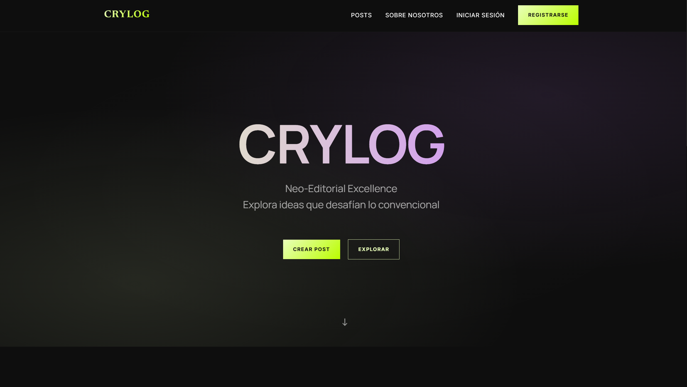
</p>

### 🔐 Autenticación

<table>
  <tr>
    <td align="center" width="50%">
      <strong>Login</strong><br>
      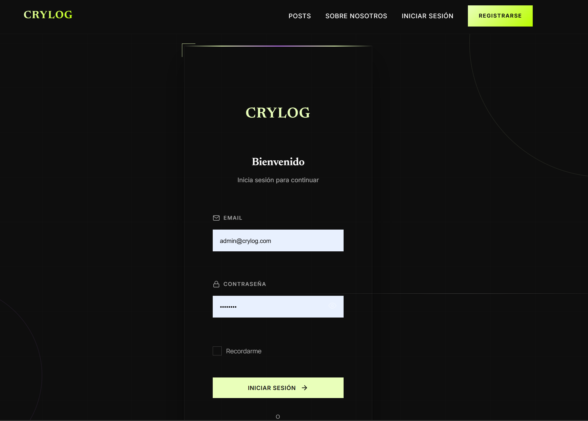
    </td>
    <td align="center" width="50%">
      <strong>Registro</strong><br>
      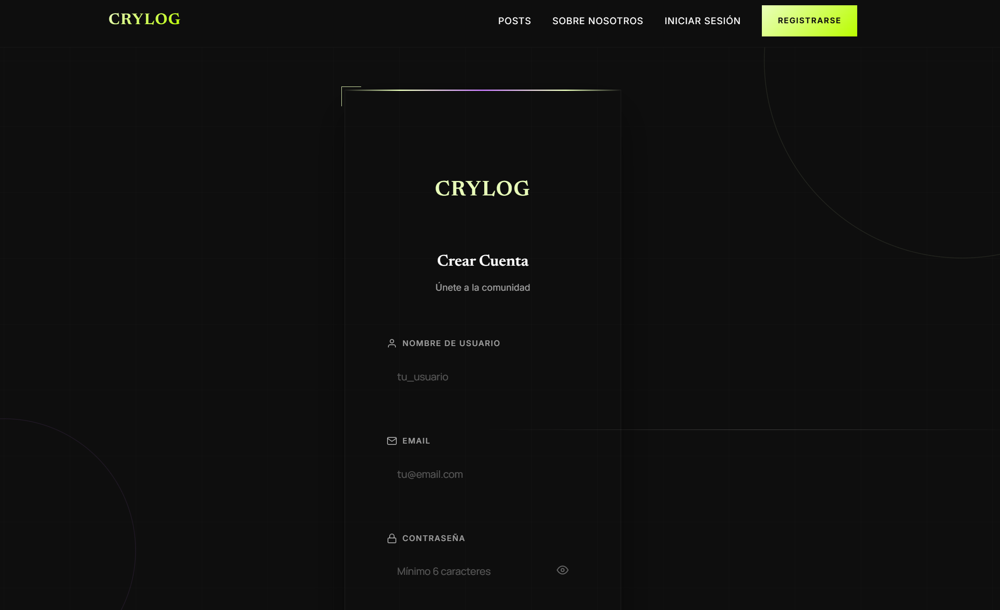
    </td>
  </tr>
</table>

### 📝 Grid de Posts

<table>
  <tr>
    <td align="center" width="33%">
      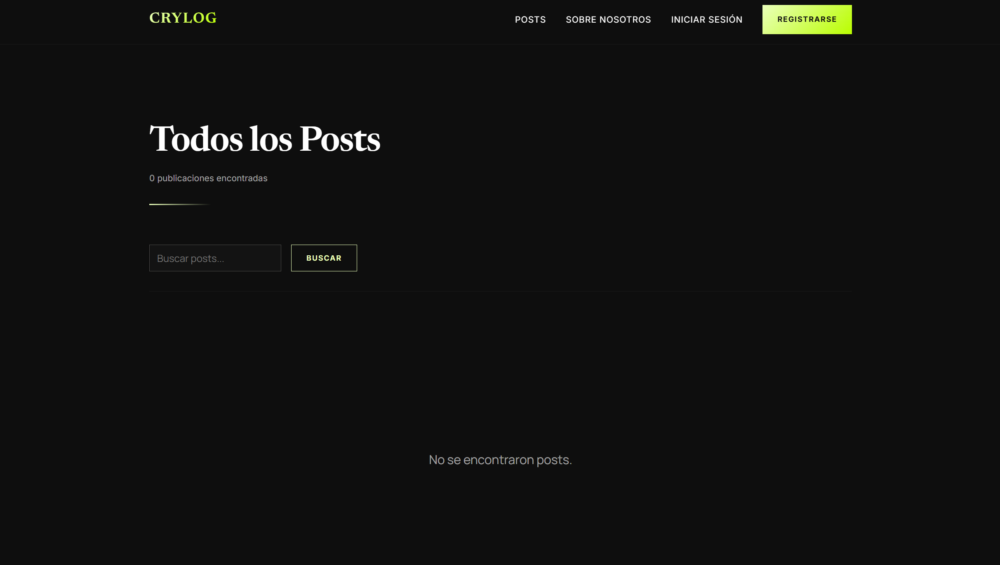
    </td>
    <td align="center" width="33%">
      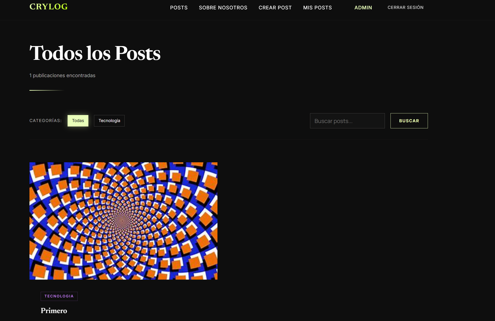
    </td>
    <td align="center" width="33%">
      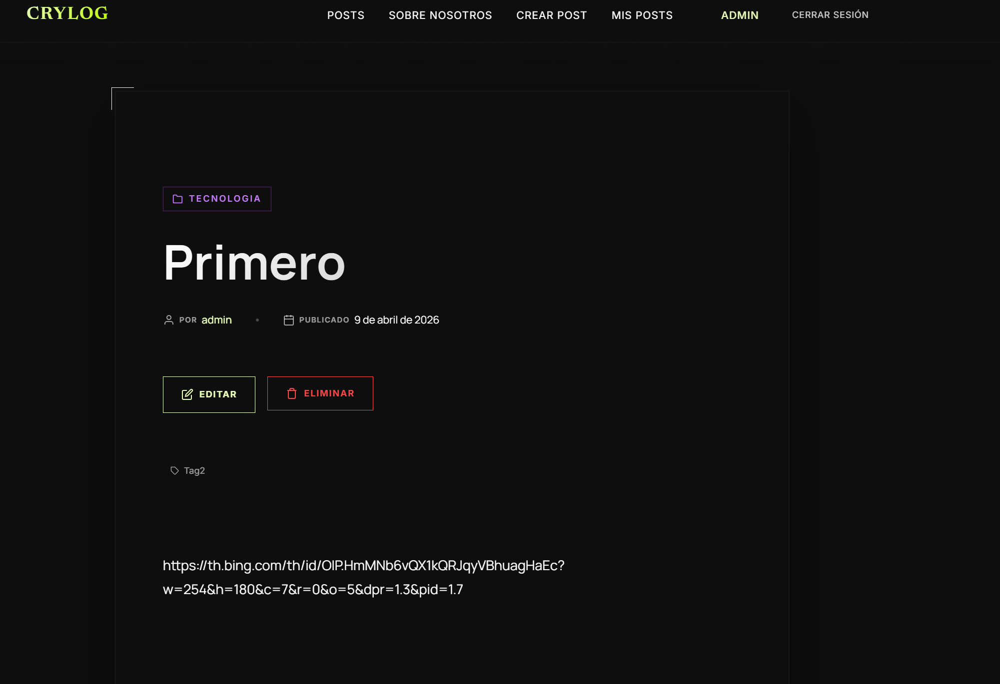
    </td>
  </tr>
</table>

### ✍️ Gestión de Posts

<table>
  <tr>
    <td align="center" width="50%">
      <strong>Crear Nuevo Post</strong><br>
      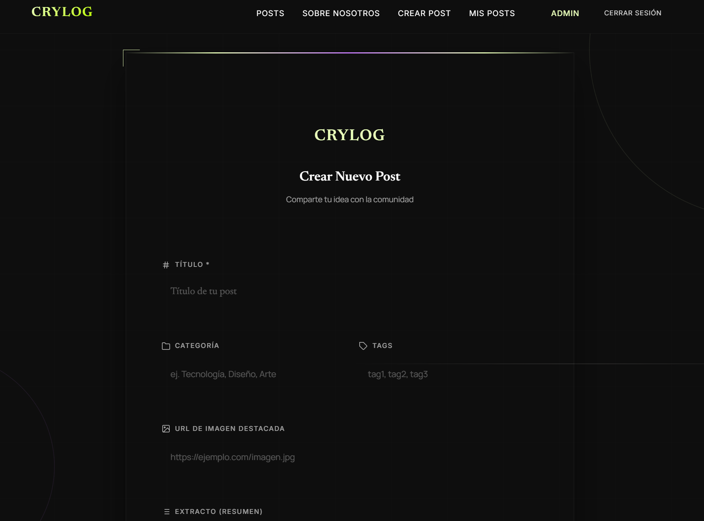
    </td>
    <td align="center" width="50%">
      <strong>Editar Post</strong><br>
      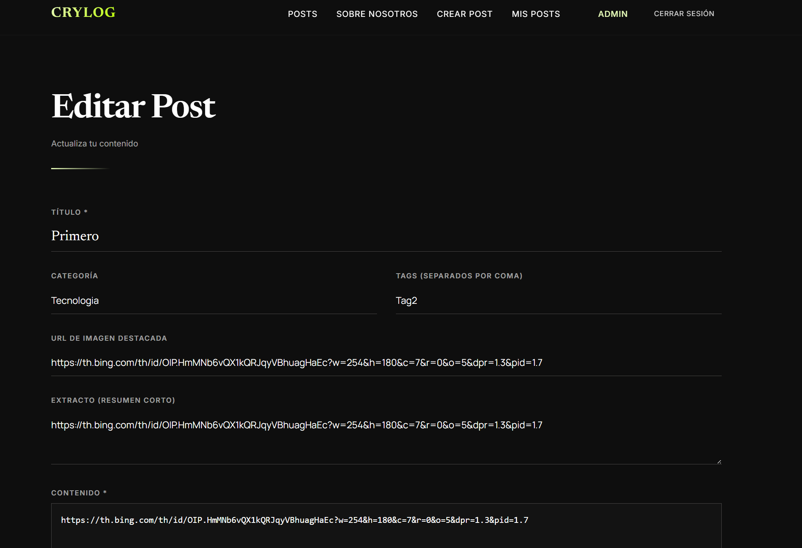
    </td>
  </tr>
</table>

### 🏛️ Sobre Nosotros

<table>
  <tr>
    <td align="center" width="50%">
      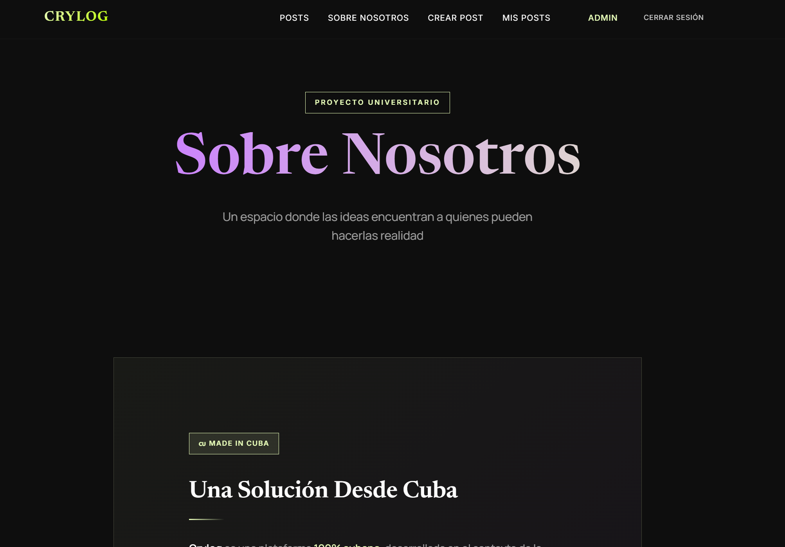
    </td>
    <td align="center" width="50%">
      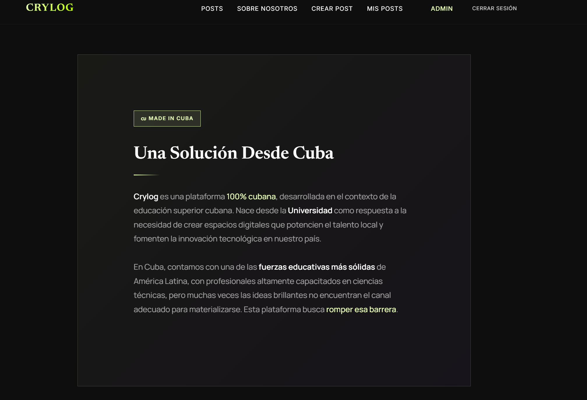
    </td>
  </tr>
  <tr>
    <td align="center" width="50%">
      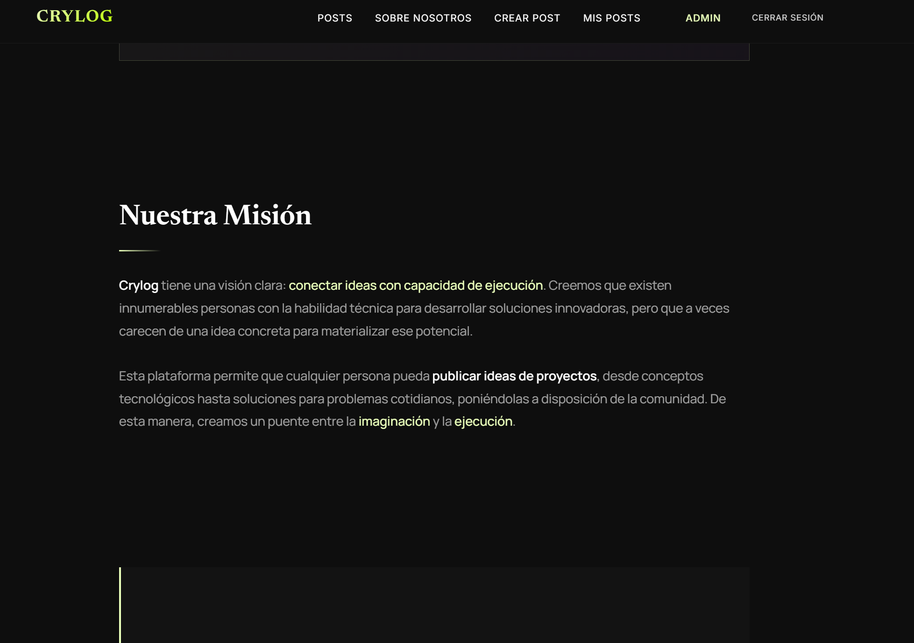
    </td>
    <td align="center" width="50%">
      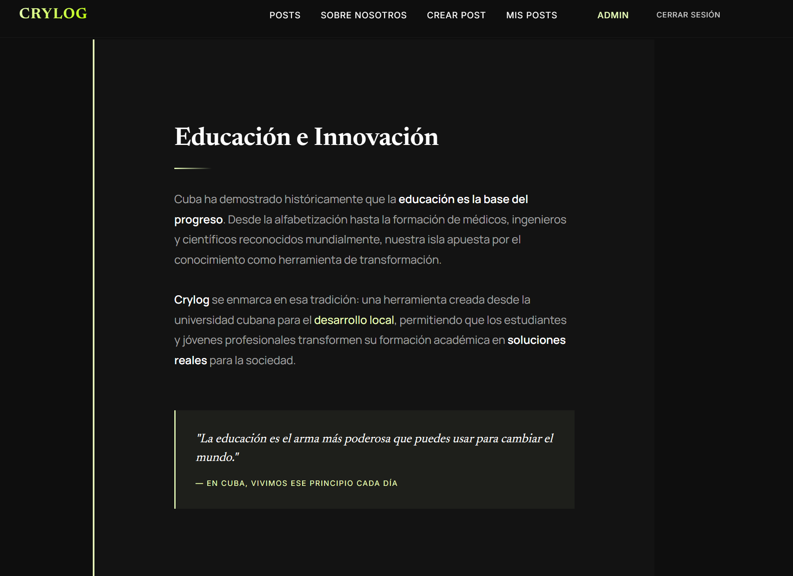
    </td>
  </tr>
  <tr>
    <td align="center" width="50%">
      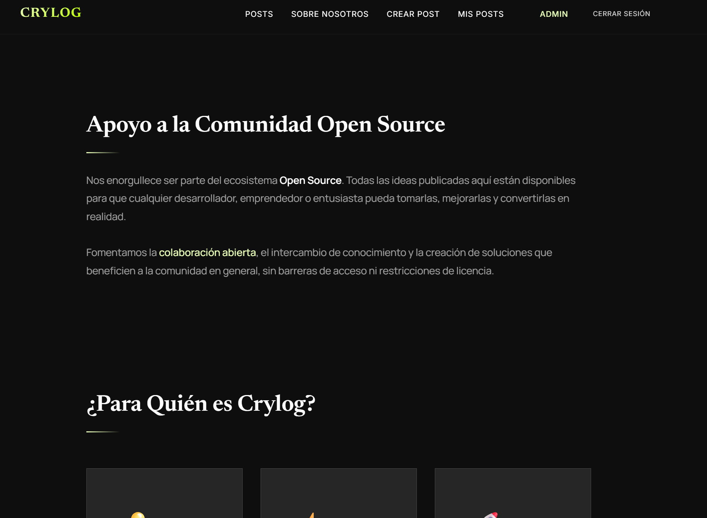
    </td>
    <td align="center" width="50%">
      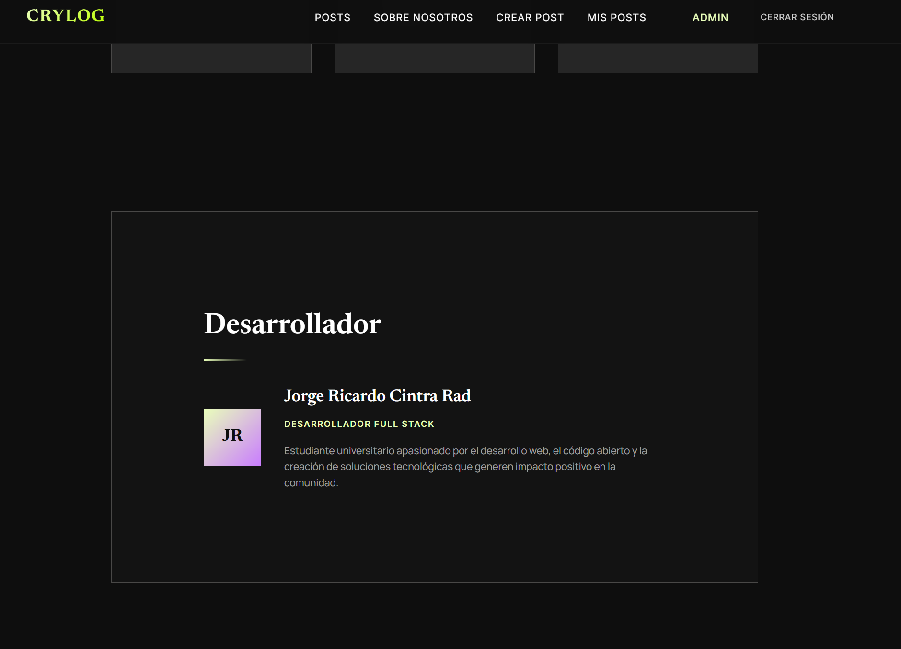
    </td>
  </tr>
</table>

---

## ✨ Características

### 🎨 Diseño Premium Neo-Editorial
- **Dark Theme** elegante con colores corporativos
- **Glassmorphism** en navegación y cards
- **Tipografía editorial** (Newsreader, Manrope, Inter)
- **Animaciones fluidas** y micro-interacciones
- **100% Responsive** (mobile, tablet, desktop)
- **Sin esquinas redondeadas** - diseño moderno angular

### 🔐 Autenticación Segura
- **JWT Tokens** en cookies HTTP-only
- **bcryptjs** para hash de contraseñas (salt rounds 10)
- **Dos roles**: `user` (CRUD propio) y `admin` (acceso total)
- **Protección de rutas** con middleware
- **Validación de inputs** con express-validator

### 📝 Gestión de Contenido
- **CRUD completo** de posts con editor enriquecido
- **Categorías y tags** para organización
- **Estados**: Publicado y Borrador
- **Imágenes destacadas** (URLs externas)
- **Extractos automáticos** del contenido
- **Slugs SEO-friendly** generados automáticamente

### 🔍 Descubrimiento
- **Paginación** (`?page=2&limit=10`)
- **Búsqueda por texto** en títulos y contenido
- **Filtrado por categoría**
- **Feeds cronológicos** con metadata

---

## 🎯 Funcionalidades Principales

| Módulo | Funcionalidad | Estado |
|--------|---------------|--------|
| **Auth** | Registro de usuarios | ✅ |
| **Auth** | Login con JWT | ✅ |
| **Auth** | Logout seguro | ✅ |
| **Auth** | Roles (user/admin) | ✅ |
| **Posts** | Crear post | ✅ |
| **Posts** | Listar posts (público) | ✅ |
| **Posts** | Ver detalle de post | ✅ |
| **Posts** | Editar post (autor/admin) | ✅ |
| **Posts** | Eliminar post (autor/admin) | ✅ |
| **Posts** | Paginación | ✅ |
| **Posts** | Búsqueda y filtros | ✅ |
| **UI** | Diseño responsive | ✅ |
| **UI** | Animaciones y transiciones | ✅ |
| **Seguridad** | Helmet.js headers | ✅ |
| **Seguridad** | Validación de inputs | ✅ |
| **Tests** | Tests automatizados (Jest) | ✅ |

---

## 🏗️ Arquitectura

```
┌─────────────────────────────────────────────────────────────┐
│                      CLIENTE (Browser)                       │
└──────────────────────┬──────────────────────────────────────┘
                       │ HTTP Requests
┌──────────────────────▼──────────────────────────────────────┐
│                      EXPRESS SERVER                          │
│  ┌──────────────┐  ┌──────────────┐  ┌──────────────┐       │
│  │   Helmet     │  │   Morgan     │  │   Validator │       │
│  │  (Security)  │  │   (Logs)     │  │  (Validate) │       │
│  └──────────────┘  └──────────────┘  └──────────────┘       │
│                        │                                     │
│  ┌─────────────────────▼──────────────────────────┐         │
│  │              ROUTES (auth, posts)               │         │
│  └─────────────────────┬──────────────────────────┘         │
│                        │                                     │
│  ┌─────────────────────▼──────────────────────────┐         │
│  │           CONTROLLERS (auth, post)              │         │
│  └─────────────────────┬──────────────────────────┘         │
│                        │                                     │
│  ┌─────────────────────▼──────────────────────────┐         │
│  │              MODELS (User, Post)                │         │
│  └─────────────────────┬──────────────────────────┘         │
└────────────────────────┼────────────────────────────────────┘
                         │ SQL Queries
┌────────────────────────▼────────────────────────────────────┐
│                  SUPABASE (PostgreSQL)                       │
│              ┌──────────────┬──────────────┐                │
│              │    users     │    posts     │                │
│              └──────────────┴──────────────┘                │
└─────────────────────────────────────────────────────────────┘
```

### Estructura de Carpetas

```
crylog/
├── 📁 __tests__/                    # Tests Jest
│   ├── auth.test.js
│   ├── posts.test.js
│   └── setup.js
├── 📁 config/
│   └── database.js                 # Configuración Supabase
├── 📁 controllers/
│   ├── authController.js           # Lógica de auth
│   └── postController.js           # Lógica de posts
├── 📁 middlewares/
│   ├── auth.js                     # JWT & roles
│   └── errorHandler.js             # Manejo de errores
├── 📁 models/
│   ├── User.js                     # Modelo usuario
│   └── Post.js                     # Modelo post
├── 📁 public/
│   ├── css/style.css               # Estilos Neo-Editorial
│   └── js/main.js                  # JavaScript cliente
├── 📁 routes/
│   ├── auth.js                     # Rutas /auth
│   └── posts.js                    # Rutas /posts
├── 📁 views/                        # Templates EJS
│   ├── partials/                   # Componentes
│   ├── layouts/                    # Layouts base
│   ├── auth/                       # Login/Register
│   ├── posts/                      # CRUD posts
│   ├── about.ejs                   # Página About
│   └── error.ejs                   # Página error
├── 📄 .env                         # Variables de entorno
├── 📄 app.js                       # Punto de entrada
├── 📄 jest.config.js               # Configuración Jest
├── 📄 package.json                 # Dependencias
└── 📄 README.md                    # Este archivo
```

---

## 🛠️ Tecnologías

### Core
| Tecnología | Versión | Propósito |
|------------|---------|-----------|
| **Node.js** | 20+ LTS | Runtime JavaScript |
| **Express.js** | 4.18+ | Framework web |
| **EJS** | 3.1+ | Motor de plantillas |
| **express-ejs-layouts** | 2.5+ | Sistema de layouts |

### Base de Datos
| Tecnología | Propósito |
|------------|-----------|
| **Supabase** | PostgreSQL cloud |
| **PostgreSQL** | 14+ Base de datos relacional |

### Seguridad
| Tecnología | Propósito |
|------------|-----------|
| **jsonwebtoken** | JWT tokens |
| **bcryptjs** | Hash de contraseñas |
| **helmet** | Security headers HTTP |
| **express-validator** | Validación de inputs |
| **cookie-parser** | Manejo de cookies |

### Utilidades
| Tecnología | Propósito |
|------------|-----------|
| **dotenv** | Variables de entorno |
| **morgan** | Logging HTTP |
| **connect-flash** | Mensajes flash |
| **method-override** | HTTP methods (PUT/DELETE) |

### Testing
| Tecnología | Propósito |
|------------|-----------|
| **jest** | Framework de testing |
| **supertest** | HTTP assertions |

---

## ⚙️ Instalación Local

### 1️⃣ Clonar Repositorio

```bash
git clone https://github.com/tu-usuario/crylog.git
cd crylog
```

### 2️⃣ Instalar Dependencias

```bash
npm install
```

### 3️⃣ Configurar Variables de Entorno

```bash
cp .env.example .env
# Editar .env con tus credenciales
```

### 4️⃣ Configurar Base de Datos

Ejecutar el SQL en Supabase SQL Editor:

```sql
-- Tabla de usuarios
CREATE TABLE users (
    id UUID DEFAULT gen_random_uuid() PRIMARY KEY,
    username VARCHAR(30) UNIQUE NOT NULL,
    email VARCHAR(255) UNIQUE NOT NULL,
    password VARCHAR(255) NOT NULL,
    role VARCHAR(20) DEFAULT 'user' CHECK (role IN ('user', 'admin')),
    created_at TIMESTAMP WITH TIME ZONE DEFAULT NOW(),
    updated_at TIMESTAMP WITH TIME ZONE DEFAULT NOW()
);

-- Tabla de posts
CREATE TABLE posts (
    id UUID DEFAULT gen_random_uuid() PRIMARY KEY,
    title VARCHAR(200) NOT NULL,
    content TEXT NOT NULL,
    slug VARCHAR(220) UNIQUE NOT NULL,
    excerpt TEXT,
    featured_image TEXT,
    category VARCHAR(50),
    tags TEXT[] DEFAULT '{}',
    status VARCHAR(20) DEFAULT 'published' CHECK (status IN ('published', 'draft')),
    author_id UUID REFERENCES users(id) ON DELETE CASCADE,
    created_at TIMESTAMP WITH TIME ZONE DEFAULT NOW(),
    updated_at TIMESTAMP WITH TIME ZONE DEFAULT NOW()
);

-- Índices
CREATE INDEX idx_posts_status ON posts(status);
CREATE INDEX idx_posts_category ON posts(category);
CREATE INDEX idx_posts_author ON posts(author_id);
CREATE INDEX idx_posts_created ON posts(created_at DESC);

-- Triggers para updated_at
CREATE OR REPLACE FUNCTION update_updated_at_column()
RETURNS TRIGGER AS $$
BEGIN
    NEW.updated_at = NOW();
    RETURN NEW;
END;
$$ language 'plpgsql';

CREATE TRIGGER update_users_updated_at BEFORE UPDATE ON users
    FOR EACH ROW EXECUTE FUNCTION update_updated_at_column();

CREATE TRIGGER update_posts_updated_at BEFORE UPDATE ON posts
    FOR EACH ROW EXECUTE FUNCTION update_updated_at_column();
```

### 5️⃣ Iniciar Servidor

```bash
# Desarrollo (con auto-reload)
npm run dev

# Producción
npm start
```

🌐 La aplicación está disponible en: **https://crylog-proyecto-final.onrender.com/**

---

## 🔧 Variables de Entorno

Crear archivo `.env` en la raíz:

```env
# ==========================================
# ENTORNO
# ==========================================
NODE_ENV=development
PORT=3000

# ==========================================
# SUPABASE (Obtener de: https://app.supabase.com)
# ==========================================
SUPABASE_URL=https://tu-proyecto.supabase.co
SUPABASE_ANON_KEY=tu-anon-key-aqui
SUPABASE_SERVICE_ROLE_KEY=tu-service-role-key-aqui

# ==========================================
# JWT CONFIGURATION
# Mínimo 32 caracteres para seguridad
# ==========================================
JWT_SECRET=tu-super-secret-key-muy-largo-aleatorio-32-chars
JWT_EXPIRES_IN=24h

# ==========================================
# SESSION
# ==========================================
SESSION_SECRET=tu-session-secret-muy-largo-aleatorio-32-chars

# ==========================================
# APP CONFIG
# ==========================================
APP_NAME=Crylog
APP_URL=http://localhost:3000
```

---

## 📊 API Endpoints

### 🔐 Autenticación

| Método | Endpoint | Descripción | Auth Requerida |
|--------|----------|-------------|----------------|
| `GET` | `/auth/register` | Formulario registro | ❌ |
| `POST` | `/auth/register` | Crear cuenta | ❌ |
| `GET` | `/auth/login` | Formulario login | ❌ |
| `POST` | `/auth/login` | Iniciar sesión | ❌ |
| `GET` | `/auth/logout` | Cerrar sesión | ✅ |
| `GET` | `/auth/me` | Perfil usuario | ✅ |

### 📝 Posts

| Método | Endpoint | Descripción | Auth Requerida |
|--------|----------|-------------|----------------|
| `GET` | `/posts` | Listar posts | ❌ |
| `GET` | `/posts?page=2&limit=10` | Paginación | ❌ |
| `GET` | `/posts?search=nodejs` | Búsqueda | ❌ |
| `GET` | `/posts?category=tech` | Filtrar categoría | ❌ |
| `GET` | `/posts/slug/:slug` | Ver post | ❌ |
| `GET` | `/posts/my-posts` | Mis posts | ✅ |
| `GET` | `/posts/create` | Formulario crear | ✅ |
| `POST` | `/posts/create` | Crear post | ✅ |
| `GET` | `/posts/:id/edit` | Formulario editar | ✅ 👤 |
| `PUT` | `/posts/:id` | Actualizar post | ✅ 👤 |
| `DELETE` | `/posts/:id` | Eliminar post | ✅ 👤 |

> ✅ = Requiere autenticación<br>
> 👤 = Requiere ser autor o admin

### 📦 Respuesta JSON (API)

```json
{
  "success": true,
  "data": [
    {
      "id": "550e8400-e29b-41d4-a716-446655440000",
      "title": "Introducción a Node.js",
      "slug": "introduccion-a-nodejs",
      "content": "<p>Contenido HTML...</p>",
      "excerpt": "Resumen del post...",
      "category": "Tecnología",
      "tags": ["nodejs", "javascript", "backend"],
      "status": "published",
      "author": {
        "id": "550e8400-e29b-41d4-a716-446655440001",
        "username": "johndoe",
        "email": "john@example.com"
      },
      "created_at": "2024-01-15T10:30:00Z",
      "updated_at": "2024-01-15T10:30:00Z"
    }
  ],
  "pagination": {
    "page": 1,
    "limit": 10,
    "total": 50,
    "totalPages": 5
  }
}
```

---

## 🎨 Design System

### Paleta de Colores

| Token | Valor | Uso |
|-------|-------|-----|
| `--surface` | `#0e0e0e` | Fondo principal |
| `--on-surface` | `#ffffff` | Texto principal |
| `--primary` | `#e9ffba` | Acento lima (botones, highlights) |
| `--primary-container` | `#bafd00` | Acento lima intenso |
| `--secondary` | `#c97cff` | Acento púrpura (categorías, links) |
| `--surface-container` | `#262626` | Cards y elevaciones |
| `--surface-container-high` | `#333333` | Inputs, hover states |
| `--outline` | `#494847` | Bordes sutiles |

### Tipografía

| Uso | Fuente | Peso |
|-----|--------|------|
| **Display** (títulos) | Newsreader (serif) | 400, 600 |
| **Body** (contenido) | Manrope (sans-serif) | 400, 500, 600 |
| **Utility** (labels, meta) | Inter (sans-serif) | 400, 500 |

### Características Visuales

- **Glassmorphism**: `backdrop-filter: blur(20px)` en navegación
- **Bordes**: 0.5px para sutileza (no 1px)
- **Border Radius**: 0px (diseño angular moderno)
- **Espaciado**: Márgenes dramáticos 80px-200px
- **Sombras**: `0 20px 40px rgba(0,0,0,0.4)` para elevación

---

## 🔐 Seguridad

- ✅ **Helmet.js** - Headers de seguridad HTTP (CSP, HSTS, etc.)
- ✅ **JWT Tokens** - Firmados y verificados, expiración configurable
- ✅ **bcryptjs** - Hash de contraseñas con salt rounds 10
- ✅ **express-validator** - Sanitización y validación de inputs
- ✅ **Cookies HTTP-only** - Tokens no accesibles por JavaScript
- ✅ **CSP** - Content Security Policy configurado
- ✅ **Method Override** - Simulación de PUT/DELETE vía POST
- ✅ **Protección de Rutas** - Middleware de autenticación y autorización

---

## 🧪 Testing

El proyecto incluye tests automatizados con **Jest** y **Supertest**.

### Ejecutar Tests

```bash
# Ejecutar todos los tests
npm test

# Ejecutar en modo watch (desarrollo)
npm test -- --watch

# Verbose
npm test -- --verbose
```

### Tests Implementados

- ✅ `GET /auth/login` - Formulario de login
- ✅ `GET /auth/register` - Formulario de registro
- ✅ `POST /auth/login` - Rechazo de credenciales inválidas
- ✅ `GET /posts` - Listado de posts públicos
- ✅ `GET /posts/slug/:slug` - Detalle de post
- ✅ `GET /posts/create` - Protección de rutas privadas
- ✅ `GET /posts/my-posts` - Protección de rutas privadas

---

## 👨‍💻 Autor

**Jorge Cintra Rad**

Desarrollado como proyecto final del curso optativo de **Node.js**.

---

## 📄 Licencia

Este proyecto está bajo la licencia **Creative Common**

---

<p align="center">
  <strong>⭐ Si te gustó este proyecto, dale una estrella!</strong>
</p>
